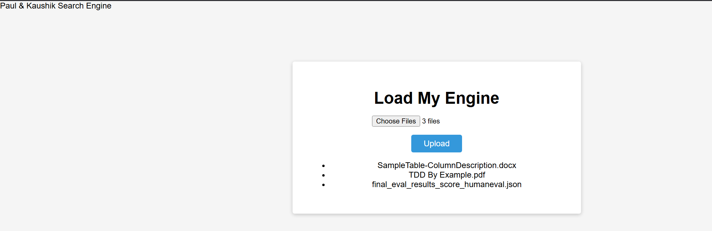
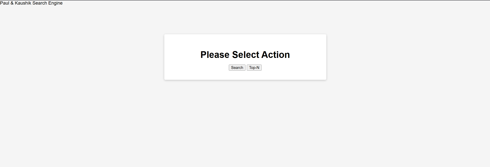
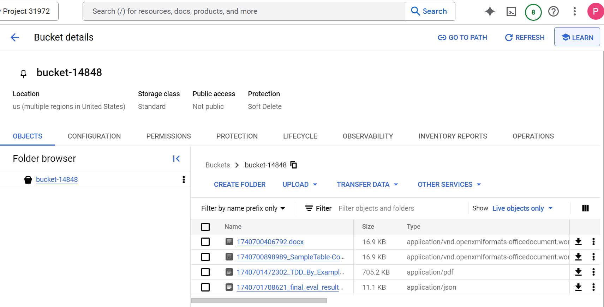

Partner: Kaushik Deka (andrewid: kaushikd) 
**Docker iamges URL** 
- Server image: https://hub.docker.com/r/pkotchav/proj-op2-server
- Client image: https://hub.docker.com/r/pkotchav/client

In order to run this code, simple clone the repository. Then, at the root
1. docker-compose build (this will pull the image fron docker hub) 
3. docker-compose up

Once successful execution of "docker-compose up" command, the client can be reached at localhost:8080 
The file is uploaded to a google cloud storage bucket

Screenshot of main and upload page: 

Screenshot of subsequent search and top N page: 

Screenshot of files in google cloud bucket: 

