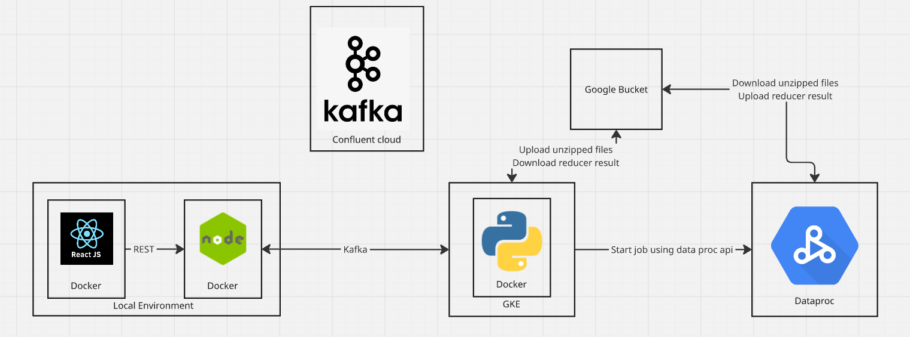

[](https://classroom.github.com/a/Xjl5orOJ)

Partner: Kaushik Deka (andrewid: kaushikd) 
**Docker iamges URL** 
- Server image: https://hub.docker.com/r/pkotchav/proj-op2-server
- Client image: https://hub.docker.com/r/pkotchav/client

In order to run this code, simple clone the repository. Then, at the root
1. docker-compose build (this will pull the image fron docker hub) 
3. docker-compose up

Once successful execution of "docker-compose up" command, the client can be reached at localhost:8080 
The file is uploaded to a google cloud storage bucket

Screenshot of main and upload page: 


Screenshot of subsequent search and top N page: 


Screenshot of files in google cloud bucket: 


Architecture 


Steps:

# Application Setup Instructions

Follow these steps to set up and run the application. This guide includes everything from setting up required accounts and services to deploying the app using Terraform and Docker.

---

## Prerequisites

- Google Cloud account
- Confluent Kafka account
- Docker installed
- Terraform installed

---

## Setup Steps

### 1. Create Google Cloud Service Account
1. Go to **Google Cloud Console** and create a new service account.
2. Assign the following roles and permissions to the service account:
   - `roles/dataproc.admin`
   - `roles/dataproc.worker`
   - `roles/editor`
   - `roles/storage.admin`

---

### 2. Download API Keys and Set Environment Variable
1. Download the service account key file (`JSON` file) from Google Cloud Console.
2. Set the environment variable to point to the key file:
export GOOGLE_APPLICATION_CREDENTIALS="/path/to/service-account-key.json"

 

---

### 3. Create Confluent Kafka Account
1. Sign up for **Confluent Kafka** at [Confluent Cloud](https://www.confluent.io/get-started).
2. Obtain the **API keys**.
3. Create a Kafka cluster and manage resources as needed.

---

### 4. Update `terraform.tfvars`
1. Open the `terraform.tfvars` file in the Terraform project directory.
2. Fill in the required variables:
- Google Cloud service account details
- Kafka API keys
- Other configuration parameters specific to your setup.

---

### 5. Install Terraform
1. Install **Terraform**:
- For macOS:
  ```
  brew install terraform
  ```
- For Ubuntu/Debian:
  ```
  sudo apt-get update && sudo apt-get install terraform
  ```
2. Verify the installation:
terraform --version

 

---

### 6. Initialize and Apply Terraform Configuration
1. Navigate to the `terraform` directory:
cd terraform

 
2. Initialize Terraform:
terraform init

 
3. Apply the configuration to create resources:
terraform apply

 
- Type `yes` when prompted.

---

### 7. Pull and Run React Application
1. Pull the React application Docker image:
docker pull kaushikdkrikhanu/reactapp:002

 
2. Run the React app on port `3001`:
docker run -p 3001:80 kaushikdkrikhanu/reactapp:002

 

---

### 8. Set Up Kafka Client
1. In the Kafka cluster created by Terraform:
- Create a **Kafka client**.
- Download the **client code** for **Node.js**.
- Place the `client.properties` file in the server directory of your project.

---

### 9. Build and Run the Server Application
1. Build the server Docker image:
docker build -t <image_name> .

 
2. Run the server on port `3000`:
docker run -p 3000:3000 <image_name>